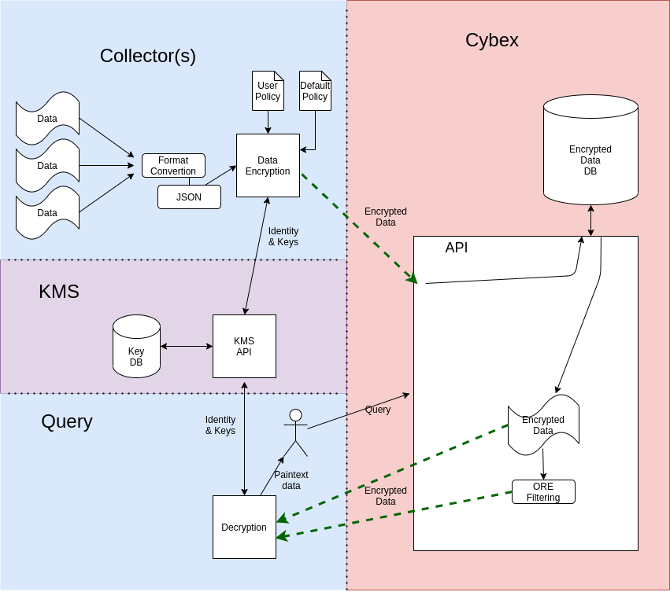
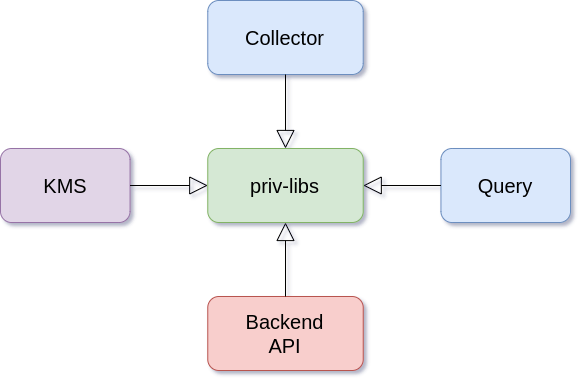

Welcome to the Privacy Preservation wiki!


# Overview

Privacy preserving information sharing. This project aims to share data with only the parties that meet certain attributes. In this model no party is truxted with the exeption of the oneself and the Key Distribution Service(KMS). This sharing of Information is as follows:

1. An organization enrolls in the system via KMS
    - KMS generates secrets keys for that party
2. Enrolled organizations deploy collector with their desired encryption policies
    - Organizations share encrypted information (using deterministic and CPABE encryption)
      - to be stored by untrusted party
3. Organizations can request/query the storage server for encrypted data
    - organization will only be able to decrypt if their attributes matches the encryption policy for that data(field wise)
    - this is enforced with CPABE encryption


This project was built using docker. For help regathering docker please visit [docker docs](https://docs.docker.com/).
## Structure
Structure of the overall project is as follows


The system has 4 parts. The collector is in charge of encrypting the data with the encryption policy set by the organization that wants to share the data. The collector has two parts (not in the diagram), the encryption module and the gatherer, the encryption module just encrypts any data sent to it by one or more gatherers(they just collect the data) and ships it over encrypted to the backend DB.

The backend/API/DB just collects the encrypted data and stores it into a DB. when the system is queried it returns applicable data, using DE and ORE encryptions. 

The query client just handles queries from a user. It handles all processing to carry out this operations. That is,t he encryption of the query, the query itself, and the decryption of the data. A user queries and it outputs data. The user querying will only be able to decrypt data that the original encrypting user desired, this is enforced with CPABE.

The KMS handles key creation for new members of the system. This also includes attributes, new keys are generated based on a users/orgs attributes. Keys with attributes allow users to decrypt information that the encrypting user desired. The KMS is used by the collector to get the public keys when encrypting, by the administrator when setting up the collectors policy to determine available attributes, by the backend to retrieve the ORE key to filter requests numerically, by the query client to get private keys for decryption purposes. The KMS server is not needed at runtime if keys are preloaded and stored locally by each software, in this case, KMS is only used for key creation. 

## Images Layout
Layout of the docker images   
  

The privacy library image is the base image for all other modules.

# Descriptions

### Privacy libraries

This image is the base image for the other images. This image contains:

- Base encryption libraries
  - Deterministic encryption
  - Order Revealing Encryption (ORE)
  - Ciphertext-Policy Attribute-Based Encryption (CPABE)
- Encryption tests
- Key generation
- Functions to communicate with APIs on the system
- Other common functions
  - Database manager
  - File manager


### Collector
This module contains two sudmodules:
1. The collector, which handles encryption
2. Collector-client, which ship JSON logs to the collector

In this case this collector-client grabs a JSON file and ships it to the collector. Keep in mind that this client can be anything in the organization premise as long as it can send JSON via a TCP socket (one record per connection).   

The wrapper script for this module can also query the KMS for possible attributes. This helps for determining possible values for the encryption policy.

### KMS
This module handles:
- Key creation
- Key distribution
- Attribute management

The API is detailed TODO [here]().   

This module requires a Mongo database. The wrapper script initializes runs a MngoDB image. If that is not desired then one can modify the `docker-compose.yaml` file and comment out the database section(alternatively use the deprecated script). With the database commented out, we can now edit the config file and specify another Mongo database URI. 

### Backend API

This module is the interface for the following functions:
- Storage of encrypted data
- Retrieval of encrypted data
  - Encrypted data filtering

The API is detailed TODO [here]().   

This module requires a Mongo database. The wrapper script initializes runs a MngoDB image. If that is not desired then one can modify the `docker-compose.yaml` file and comment out the database section(alternatively use the deprecated script). With the database commented out, we can now edit the config file and specify another Mongo database URI. 


### Query

This module allows us to:    
- query the backend API
  - query with time range
    - <, <=, >, >=
  - retrieval of encrypted data
- decrypt encrypted data, CPABE permitting

## Wrapper scripts
These scripts help build, create containers, run, and remove the project images. There is one per module as follows:   
|Module|Script|Capabilities|
|:-:|-|-|
|prib-libs|build.sh, build-run-shell.sh|build, run shell|
|Collector|collector.sh|build, run, shell, remove|
|KMS|kms.sh|build, run, remove|
|Query|query.sh|build, run,shell, remove|
|Backend API|backend.sh|build, run, remove|

To run wrapper scripts, please execute from the folder it is located e.i. cd into the folder before executing it.   

Please add user to `docker` group. Run scripts without `sudo`, scrips will ask to elevate only when its needed. Adding user to the group is highly recommended as it will prevent executing code elevated when not needed and it will also not ask to elevate, therefore no user intervention.   

Simpler deprecated scripts also provided in the respective `deprecated-scrips` folder. To use, move script into the root of the module and execute.

# Installation
1. Install dependencies
2. Build images or fetch images
3. Configure parts
4. Run each part

## Dependencies
This project has multiple dependencies, these are handled by the dockerfiles when the images are built. As long as the there is internet access while building the images, the project will handle its own dependencies.

Here is a list of dependencies for this project:
- bash (installed in most systems already)
- [Docker](https://docs.docker.com/engine/install/)
- [docker-compose](https://docs.docker.com/compose/install/)

These are widely used packeges, therefore they are available for almost every distribution. Please consult with your distribution for more information on how to install these for your machine.

### Other Requirements

#### Linux
Linux machine is required to run this project. Even though Docker grants us the ability to port projects, in this case our build procedure only supports Linux at the moment.

#### Docker group
It is recommended to add the user that will be running the wrapper scripts to the `docker` user group. This will allow the script to connect to the docker socket without the need to elevate privileges (e.g. sudo). The wrapper scripts automatically detect whether or not the user is part of the group and executes commands accordingly. The `root` user can skip this section.
```bash
# login as the user that will be executing the wrapper scripts

# add the docker group if it doesnt exist
# check existence with
cat /etc/group | grep docker

# create group
sudo groupadd docker

# add current user to docker group
sudo usermod -aG docker $USER

```
For group changes to take effect, logout the user and log back in. Then lets check if it worked. 
```bash
# check if docker service is running 
sudo systemctl status docker
# start docker service if already not running
sudo systemctl start docker

# check if we can execute docker without sudo
docker run hello-world
````

## Building images
### Image names
The following names are useful if wishing to handle image building and container creation manually or when using the deprecated scripts: 
|Module|Names|
|:-:|-|
|priv-libs|cybexp-priv-libs|
|collector|cybexp-collector|
|query|cybexp-priv-query|
|KMS|cybexp-kms-priv|
|backend API|cybexp-priv-backend-api|

All modules depend on the priv-libs image. please build this image first before building any other image. If importing images none of the building images apply.   

All these images can be built manually by using docker's build procedure. A wrapper script is provided to handle all building. Please build before running the first time, or when code was modified. Rebuilding is not necessary if the project has already been build or imported. Building is also not necessary when changing configuration scripts, as these are mounted at run time (also handled by wrapper scripts).

### Build base image
To build the base image (cybexp-priv-libs):   
```bash
cd <project-priv-libs>
sh ./build.sh
```
### Build other images
Use the wrapper script provided in the module folder to build.   

One can use the wrapper script in the same way as running (please view run section) the module and supply the `--build` flag. If you want to only build you can also supply the `--build-only`. It is necessary to build before running the first time, this can also be done/combined when running the first time.

For example to build the collector:   
```bash
cd <project-collector>
bash collector.sh --build config.yaml
```
The  `secrets` folder that is located at the root of each module is mounted at runtime. It holds the keys. Each module has one. Keys are only fetched from the KMS server if they are not found there. One can mount an encrypted LUKS filesystem to the `secrets` folder before running this project to securely store these keys when they are at rest.

Secrets and configurations are never included in the images as they are mounted to the container at runtime.

## Fetching images TODO

When fetching the images, the base image is not necessary as the images are bundled with the base image.

### Option 1 Export import save
[tutorial](https://stackoverflow.com/a/23938978/12044480)   
[docker export](https://docs.docker.com/engine/reference/commandline/export/)   

### Option 2 Docker registry
[docker registry](https://docs.docker.com/registry/deploying/)   
[How to use your own Registry tutorial](https://www.docker.com/blog/how-to-use-your-own-registry/)

# Running
## Docker
Most Linux distributions use `systemd` as service manager, the following commands apply. If your system uses `SystemV` please look [here](https://www.digitalocean.com/community/tutorials/how-to-configure-a-linux-service-to-start-automatically-after-a-crash-or-reboot-part-2-reference)  for a brief tutorial.

Start docker service 
```bash
sudo systemctl start docker
```

Start docker at boot
```bash
sudo systemctl enable docker
```
Don not start docker at boot
```bash
sudo systemctl disable docker
```

Running the docker daemon manually also works, as long as the daemon is running when using this project.


## Running a module  TODO
To run first build the base image and the desired module image(if building, disregard if importing images).

### Configure
Create a  config file and configure. Each module provides an example configuration file. Each configuration file is commented. 
Pass this file as an argument when executing the wrapper scrips, see each wrapper script helps information. 

#### More on configurations
##### Server URLS
The format is a follows:
```
procotol://host:port
```
Protocol can be either `http` or `https`. The server administrator will let you know. 

> :warning: **Note**: There is no trailing `/`

##### Setting up the encryption policy TODO
timestamp match
default match 
exeact match
regex match


##### Collector

### Run
Execute the respective wrapper script at the root of the module. Each wrapper script support the `-h` and the `--help` flag, which will output their help/usage information.

for example the query help information looks as follows:   
```
$ ./query.sh -h
Create and run a docker container to query the encrypted backend. By default the container is left behind,
vacuum recommended. Build at least once or when code has changed.

Usage:
  ./query.sh [Options] config-file query output-file
  ./query.sh --build --build-only

Positional arguments:
  config-file           configuration file yaml
  query                 string representing any query value
  output-file           file where the unencrypted information is placed

Options arguments:
  -b, --build           build docker image
  --build-only          exit after building
  -s, --shell           run shell, ignores most flags
  -f, --from-time EPOCH integer epoch used as > filter for the query
  -t, --to-time EPOCH   integer epoch used as < filter for the query
  -l, --left-inclusive  modify the --from-time to be inclusive >=
  -r, --right-inclusive modify the --to-time to be inclusive <=
  -c, --vacuum          remove container upon exit. If more than one container
                        of this type exists, it will remove all
  -h, --help            print this help

```
when executing one can run as follows:
```bash
./query.sh config.yaml '123.123.123.123' output
# view output 
cat output
```

#### Collector
The collector is a multi-part module. The collector has the encryption module and the gatherers which ship the information to the collection encryption module to be encrypted. To run the collector correctly one has to setup the encryption policy. 

One has to start the Collector using `collectr.sh`, then one can run mulple collector clients. The only requirement for a client is that they have to connect to the collector tcp socket and send one json record per connection. 

A collector client is provided within the collector module. The dependencies are  `python3`, `python3-venv` and modules specified in `requirements.txt` (install as specified below).

Install collector dependencies(for debian based like ubuntu):
```bash
sudo apt install -y python3 python3-venv
```
To run the collector client:
```bash
cd collector-client

# make python environmnet, do once
python3 -m venv env 

# then source environment, do when wanting to run project
#  or to install dependencies
source env/bin/activate
# note (env) at left hand side of the terminal

# install dependencies, do once
pip install -r requirements.txt 

# then run client
#python3 collector-client.py --host <collector-host> --port <collector-port> <json-file>
# when running collector on the same machine this script will default to it
python3 collector-client.py <json-file>

```
# Troubleshooting
- If an error regarding `unix:///var/run/docker.sock` or permission denied, please make sure docker daemon/service is running. 
- If a module can not connect to another, make sure that the following configurations are correct:
  - the bind interface of the server
  - the address of the server in the client configuration
  - for example if server is bound to its ip, it can not be accesses via localhost, even if they are the same machine. Use it's ip
  - the address format (for clients) is as follows:
    - protocol://hostname:port
    - no slash at the end


# Important
Regardless if you are building or fetching the images there are a few things that are required to run each image, here is table:

|Module     |docker            | Building | Configuration File| DB|
|-----------|:----------------:|:--------:|:-----------------:|:-:|
|priv-libs  |:heavy_check_mark:|-         |      :x:          |-  |
|collector  |:heavy_check_mark:|priv-lib  |:heavy_check_mark: |:x:|
|query      |:heavy_check_mark:|priv-lib  |:heavy_check_mark: |:x:|
|KMS        |:heavy_check_mark:|priv-lib  |:heavy_check_mark: |:heavy_check_mark:|
|backend API|:heavy_check_mark:|priv-lib  |:heavy_check_mark: |:heavy_check_mark:|

<!-- :heavy_check_mark:
:x: -->

The wrapper scripts are not truly required but they are highly recommended.   
  
The modules that have the DB marked need to use a mongo database, it can be configured in the configuration file. By default the wrapper spawns its own docker mongodb container. The database container has the directory `db` mounted at runtime. This directory is located at the root of the module. This directory contains the contents of the mongodb. All this can be configured with the docker-compose.yaml file.

<!-- # TODO write sections

## Secrets
are stored and mounted here

## Config files are mounted this way and
each should be configured the folowing way
more documentation in each sample configuration file provided with each module. 

## Output is copied over here

## kms and backend have extra mongo database
There is a `db` folder used by the KMS and the backend API at their respective root folders. This folder is used by their database service. One can mount an encrypted LUKS filesystem to this folder before running the services, protecting the information at rest.

> :warning: **This is a test waning**: Be very careful here!

 -->