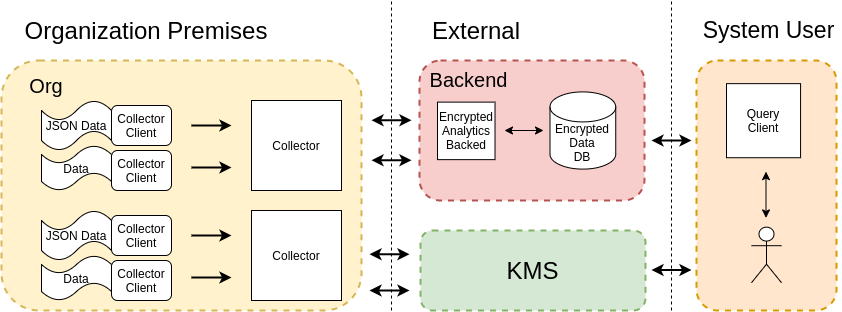
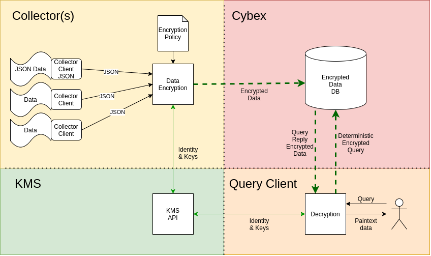
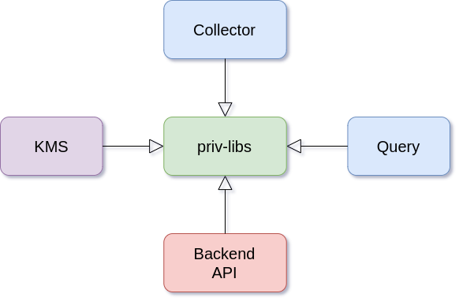

Welcome to the Encrypted Analytics wiki!

# Overview
The Encrypted Analytics project is an end-to-end fully encrypted Cyber Threat Intelligence (CTI) sharing platform supporting encrypted analytics. It aims to share data in an encrypted manner with only the parties that meet specific attributes. 

In the project model, no party trusts the underlying transportation and central storage mediums.  This project assumes that the Key Distribution Service (KMS) is a trusted entity that sharers can rely on to verify and adequately assign attributes to new platform members. 

# Sharing Overview

 

This sharing of information is as follows:

1. An organization enrolls in the system via KMS
   - KMS assigns attributes to new organizations
   - KMS generates secret keys for that party
2. Enrolled organizations deploy one or more Collectors with their desired encryption policies
   - Organizations share encrypted information (using deterministic and CPABE encryption) to be stored by the untrusted system backend
3. Organizations can request/query the storage server for encrypted data
   - organizations will be able to perform analytics on encrypted data
   - organization will only be able to decrypt the encrypted records if their attributes match the encryption policy for that specific data (field wise)
   - this is enforced with CPABE encryption

# System Structure & Data Flow
 

The structure of the overall project is as follows:

The system has four parts. The Collector is in charge of encrypting the data with the encryption policy set by the organization that wants to share the data. The Collector module itself has two parts, the encryption module and the gatherer. The encryption module encrypts any data sent to it by one or more gatherers(they collect the data) and ships it over encrypted to the backend server.

The backend/API/DB collects the encrypted data and stores it into a DB. When a user queries the backend using an encrypted version of the query, the backend returns applicable encrypted data using Deterministic Encryption (DE).

The Query Client handles queries from a user. The Query Client handles all tasks necessary to carry out a query: the encryption of the query, the API call, possible encrypted analytics(client-side analytics), and data decryption if possible. The user querying will only be able to decrypt data that the original encrypting user desired; this is enforced at encryption time with CPABE policies.

The KMS handles key creation for new system members, attribute assignment, and key distribution. New keys are generated based on a user's/org's attributes. 

The KMS is used by the Collector to get the public keys when encrypting, by the administrator when setting up the collectors policy to determine available attributes, and by the query-client to get private keys for decryption purposes. The KMS server is not needed at runtime if keys are preloaded and stored locally by each module.

# Images Layout & Descriptions
This project was build using Docker and Docker-compose. Docker simplifies the maintainability of the code. We built a Docker image in this project that acts as a central library for all other submodules. We named this image `priv-libs`, as the name implies, it contains all the code regarding encryption and decryption functions and functions that communicate with endpoints. The reason for centralizing the code into a single source image was that multiple modules would use the same code, essentially reducing programming errors. 

Layout of the docker images   
  

## Privacy libraries

This image is the base image for the other images. This image contains:

- Base encryption libraries
  - Deterministic encryption
<!--  - Order Revealing Encryption (ORE) -->
- Ciphertext-Policy Attribute-Based Encryption (CPABE)
- Encryption tests
- Key generation
- Functions to communicate with APIs on the system
- Other common functions
  - Database manager
  - File manager

## Collector
This module contains two submodules:
1. The Collector, which handles encryption
2. Collector-client, which ship JSON logs to the Collector

In this case, this collector-client grabs a JSON file and ships it to the Collector. Keep in mind that this client can be anything in the organization premise as long as it can send JSON via a TCP socket (one record per connection).   The reason for having both modules separated is that one can connect multiple collector-clients into one Collector. This separation allows various input sources into one encryption unit, where each collector client is responsible for converting the data type to JSON.  To reduce the overhead, the collector-client to collector connection is unencrypted as they should live close by. For that reason, it is highly recommended to assign the Collector to a local network interface, e.g. `127.0.0.1`, and deploy the collector-client in the same machine, so no information travels via an unencrypted medium.

An organization can also deploy multiple collectors with different policies to match each data node's requirements. 

The wrapper script for this module can also query the KMS for possible attributes, helping the policy administrator determine possible values for the encryption policies. This feature is vital since CPABE can encrypt with attributes (e.g. typos) not held by anyone, essentially creating undecryptable data. 

## KMS
This module handles:
- Key creation
- Key distribution
- Attribute management

The API is detailed TODO [here]().   

This module requires a Mongo database. The wrapper script initializes and runs a MongoDB image. 

To configure the KMS with an external MongoDB instance, one can comment out the database section in the `docker-compose.yaml` file and specify the desired MongoDB URI in the configuration file.

## Backend API

This module is the interface for the following functions:
- Storage of encrypted data
- Retrieval of encrypted data
  - Encrypted data filtering

The API is detailed TODO [here]().   

To configure the KMS with an external MongoDB instance, one can comment out the database section in the `docker-compose.yaml` file and specify the desired MongoDB URI in the configuration file.

## Query

This module allows us to:    
- query the backend API 
<!--
  - query with time range
    - <, <=, >, >= -->
  - retrieval of encrypted data
- decrypt encrypted data, CPABE permitting

# Wrapper scripts
These scripts help build, create containers, run, and remove the project images. There is one per module as follows:   
|Module|Script|Capabilities|
|:-:|-|-|
|prib-libs|build.sh, build-run-shell.sh|build, run shell|
|Collector|collector.sh|build, run, shell, remove|
|KMS|kms.sh|build, run, remove|
|Query|query.sh|build, run,shell, remove|
|Backend API|backend.sh|build, run, remove|

To run wrapper scripts, please execute from the folder each script is located, e.i. `cd` into the folder before executing it.   
